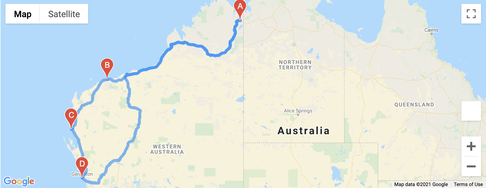

# World_Weather_Analysis

## Project Overview
Building on initial code for the PlanMyTrip app, additional enhancements were requested for Beta testing.  After sampling over 500 cities around the world for their current weather conditions, a request was made to add the description of the current weather to the app.  Then based on user inputs for high and low temperature values for the maximum temperature a subset of these cities and nearby hotels will be provided.  Next the addition of a map that provides travel route was also requested enhancement.

### Results
The results will be provided in three parts.
1. Generated 2,000 random latitudes and longitudes.  Next retrieved the nearest city utilizing the citipy module in Python.  With the cities identified, an API call to the OpenWeatherMap provided current weather conditions.  Data from the JSON request was then placed into a new DataFrame and a CSV file was exported.  The CSV file and Jupyter notebook are located here:
[WeatherPy_Database_CSV](Weather_Database/WeatherPy_Database.csv)
[Weather_Database_Jupiter Notebook](Weather_Database/Weather_Database.ipynb)
2. Next the data from the CSV file was imported into a Vacation Search Jupyter notebook.  Users are asked to input their desired **min** and **max** temperature ranges.  The database is searched for a list of cities meeting that criteria and another DataFrame is created from this subset.  Next a hotel dataframe is created to search for the nearest hotel (Google Places API) in that city utilizing it's Lat and Lng coordinates.  An output CSV file called WeatherPy_vacation.csv is created and located here:
[WeatherPy_vacation_CSV](Weather_Database/Vacation_Search/WeatherPy_vacation.csv)
A vacation search map is also provided:

Additionally a Jupyter notebook file is provided:
[Vacation_Search_notebook](Weather_Database/Vacation_Search/Vacation_Search.ipynb)
3. Finally a travel itinerary map was created.  This code utilized four cities with the same start and end cities and three stops.  Utilizing the Google Directions API the code provides directions and map images.  Assumptions were for driving between cities in this example. Those are located here:

[Vacation_Itinerary](Weather_Database/Vacation_Itinerary/Vacation_Itinerary.ipynb)

### Summary
In summary additional enhancements could include examining the weather from the prior year for the period of traveler may be interested in for a future trip.  Additional features beyond the lodging may also be added in future releases.
